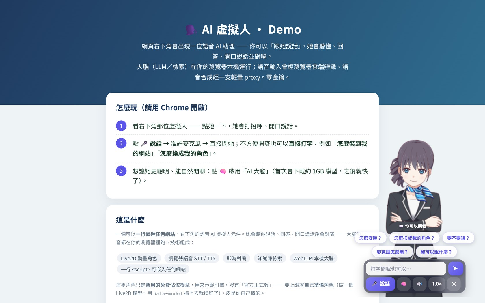
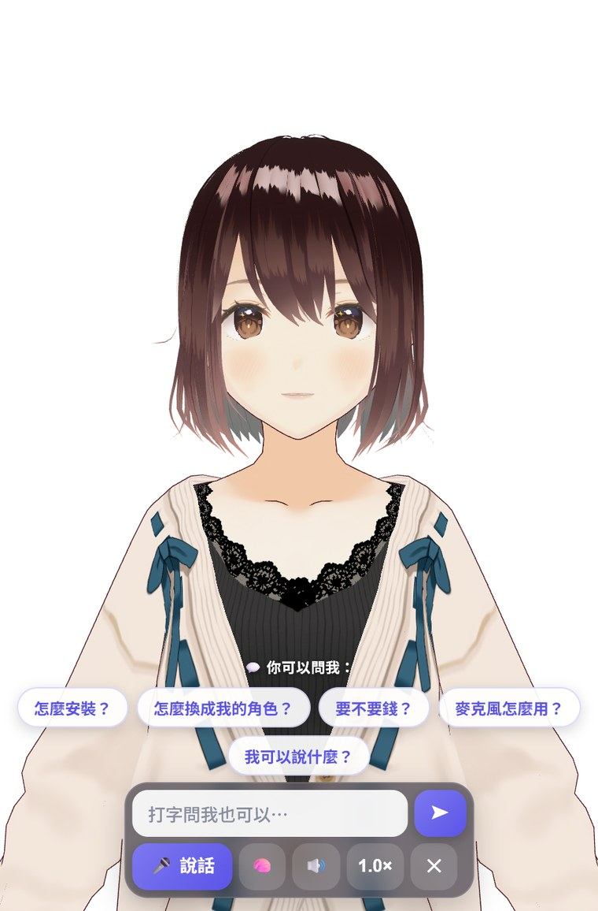

# AI Avatar Widget (Live2D / VRM Voice Assistant)

[繁體中文](README.md) | **English**

> A bottom-right-corner voice AI avatar you can embed into **any website with one `<script>` line**.
> Talk to her — she listens, answers, speaks out loud, and lip-syncs in real time.
>
> Designed as "**engine (the body) + swappable skin (character model) + content (knowledge base)**": the core is generic; swap the character and content via `data-*` attributes.
> **Pure front-end by default — no backend, no external domains required** (voice uses the browser's built-in engines; an optional serverless function upgrades you to neural voice).

🔗 Live demo: <https://ai-avatar-bot-two.vercel.app> (open in **desktop Chrome**)



---

## ✨ Features

- **Live2D animated character** with real-time **lip-sync** (mouth driven by actual audio volume)
- **Sentence-by-sentence speech**: long answers are chunked — she starts speaking the first sentence while prefetching the next; with the 🧠 in-browser LLM she **speaks while still generating**
- **Emotion expressions (3D)**: her face follows the answer (happy / surprised / sorry), easing back to neutral after speaking
- **Two personality modes**: default "guide assistant"; `data-mode="companion"` turns her into a **companion** = continuous conversation (auto-listens again after she finishes) + memory (remembers your name and past chat; stored only in the visitor's browser, say "忘記我" / "forget me" to wipe)
- **Voice input (STT)**: browser built-in speech recognition; or just **type** (Enter / ➤ to send, IME-composition safe) — answers still come back as voice + lip-sync
- **Voice output (TTS)**: neural voice (natural female voice), auto-fallback to the browser's built-in voice
- **Brain**: knowledge-base retrieval (instant, zero API keys) + optional in-browser LLM (WebLLM, zero API keys)
- **One-line embed**: `embed.js` creates an iframe widget without touching the host site

## 🧱 Architecture

| File | What it is |
|---|---|
| `index.html` | Demo landing page (embeds the widget) |
| `widget.html` | The avatar itself inside the iframe (Live2D / VRM / STT / TTS / lip-sync / LLM / retrieval) |
| `embed.js` | One-line embed loader (creates the iframe + parent↔iframe `postMessage` + public `window.AvatarWidget` API) |
| `knowledge.js` | Knowledge base (sample FAQ content — replace with your own) |
| `demo-host.html` | A fake "customer website" to demo embedding |
| `api/tts.js` | Vercel serverless function: fetches neural-voice MP3 |
| `m1-standalone.html` | Early single-file milestone (reference only, safe to delete) |

Runs as **pure front-end (HTML/JS)** by default; the serverless function is only needed for neural voice (optional). No database.

## 📥 Install (three ways, easiest first)

### Option 1 — Self-hosted (recommended: pure front-end, no backend, no external domains)
Copy `widget.html`, `embed.js`, `knowledge.js` into **your own site**, then add one line:
```html
<script src="/path/embed.js"
        data-model="your-live2d.model3.json"
        data-knowledge="your-faq.json"></script>
```
Everything runs in the visitor's browser, using built-in voices. **Zero backend, zero API keys, zero cloud cost.**

### Option 2 — Hosted one-liner (fastest to try)
Point at someone's already-deployed `embed.js` (⚠ compute & traffic are billed to whoever owns that deployment):
```html
<script src="https://your-deployment.vercel.app/embed.js"></script>
```

### Option 3 — Full setup with neural voice (more natural, human-like voice)
Neural voice needs `api/tts.js` (a serverless function). Deploy the whole repo to Vercel:
```bash
npm install
vercel --prod          # local dev: vercel dev
```
Without `data-api`, the widget tries same-origin `api/tts` automatically and falls back to browser voice if unavailable.

## 🎭 Bring your own 3D character (VRM)



This widget **ships with no 3D character** (avoids licensing and file-size problems) — the 3D skin is **yours**. Three ways to import:

**① Drag & drop (fastest, zero code)**
Drag your `.vrm` file **onto the avatar** — it instantly becomes your 3D character, and a 2D/3D toggle button appears automatically. Great for a quick try.

**② URL / embed (permanent)**
- On your site: `<script src="embed.js" data-vrm="your.vrm"></script>` (add `data-model` for 2D and you get the 2D/3D toggle)
- Local testing: `widget.html?dev=1&engine=3d&vrm=your.vrm`

**③ Where do I get a VRM?**
- **[VRoid Studio](https://vroid.com/studio)** (free) → design your own anime character, export as `.vrm`
- **[VRoid Hub](https://hub.vroid.com)** / **[Booth](https://booth.pm)** → models made by others
- **No time to make one? Try an official free sample** (paste the URL into `data-vrm` / `?vrm=`; all verified to work):
  - `Alicia` (Niconi Solid-chan, 7.8MB, [terms](https://3d.nicovideo.jp/alicia/rule.html))
    `https://cdn.jsdelivr.net/gh/vrm-c/UniVRM@master/Tests/Models/Alicia_vrm-0.51/AliciaSolid_vrm-0.51.vrm`
  - `Seed-san` (VirtualCast, [VRM Public License 1.0](https://vrm.dev/en/licenses/1.0/index))
    `https://cdn.jsdelivr.net/gh/vrm-c/vrm-specification@master/samples/Seed-san/vrm/Seed-san.vrm`
  - `Sample` (pixiv three-vrm official example)
    `https://cdn.jsdelivr.net/gh/pixiv/three-vrm@dev/packages/three-vrm/examples/models/VRM1_Constraint_Twist_Sample.vrm`

> ⚠ **Licensing**: every `.vrm` embeds usage terms set by its author (commercial use / modification) — check before commercial use; characters you make yourself in VRoid Studio are the simplest case.
> 📦 **File size**: VRMs are typically 10–30MB — **don't commit them to git**; host on a CDN / GitHub Release / your own site and point `data-vrm` at it.

<br clear="all">

## 🌐 Browser requirements

- **Desktop Chrome / Chromium** (speech recognition `webkitSpeechRecognition` is Chromium-only)
- For the 🧠 in-browser LLM: **WebGPU** (Chrome 113+)
- Microphone (for voice input); TTS and LLM require **HTTPS** (or localhost)

## ⚙️ Configuration (`data-*` attributes on `embed.js`)

| Attribute | What it does | Default |
|---|---|---|
| `data-model` | **Skin (2D)**: Live2D `.model3.json` URL | Built-in Haru sample |
| `data-vrm` | **Skin (3D)**: VRM `.vrm` URL; setting it switches to the 3D (three-vrm) engine; supports drag & drop / your own VRoid character | none (unset = 2D Live2D) |
| `data-engine` | Default engine `2d` / `3d`; **give both `data-model` + `data-vrm` and the widget grows a live 2D/3D toggle** | `2d` if a 2D skin exists, else `3d` |
| `data-mode` | **Personality**: `assistant` guide / `companion` (💬 one-tap continuous conversation + local memory) | `assistant` |
| `data-knowledge` | **Content**: knowledge-base JSON URL (array of `[{q,kw,a}]`) | built-in `knowledge.js` |
| `data-api` | **Voice backend**: neural TTS endpoint; unset = browser voice only | tries same-origin `api/tts` |
| `data-voice` | Neural voice name (backend must support it) | `zh-TW-HsiaoChenNeural` |
| `data-widget` | URL of `widget.html` | same directory as `embed.js` |
| `data-open` | Start expanded (`false` = collapsed bubble) | `true` |

Public JS API: `window.AvatarWidget.open() / close() / say(text)`.

> The neural-voice backend `api/tts.js` only accepts **same-origin** calls by default (so it can't be farmed as a free TTS proxy); allowlist extra origins with the `TTS_ALLOWED_HOSTS` env var (comma-separated). **If you deploy publicly, set a spend cap on Vercel.**

---

## 📦 Third-party assets & licenses (**read this first**)

This project's own code is **MIT** (see `LICENSE`). It **depends on** the following third parties, each under its own license, **not covered by MIT**:

| Source | License / notes |
|---|---|
| **Live2D Cubism Core** (CDN `cubism.live2d.com`) | **Proprietary** (Live2D Proprietary Software License). Not open source; check Live2D's terms for commercial use / redistribution. |
| **Haru sample model** (CDN, pixi-live2d-display test asset) | Live2D **Free Material License**, **demo only**. Replace with your own properly licensed model in production. This repo doesn't bundle model files; they're CDN-referenced. |
| **pixi.js / pixi-live2d-display** | MIT |
| **three.js / @pixiv/three-vrm** | MIT |
| **@mlc-ai/web-llm** (WebLLM) | Apache-2.0; downloaded model weights carry their own licenses (Qwen2.5 under its own terms) |
| **msedge-tts** (used by `api/tts.js`) | The package is open source, but it talks to Microsoft Edge Read Aloud's **unofficial** voice endpoint (see risks below) |

## ⚠️ Risks & limitations

- **TTS uses an unofficial endpoint**: `/api/tts` reaches Microsoft's **unofficial** Edge Read Aloud voice service via `msedge-tts` (no account, no key). **This is unsupported, may violate Microsoft's ToS, and can break or get blocked at any time.** For production, switch to official **Azure Speech** or another licensed TTS. When it fails, the widget automatically falls back to the browser's built-in voice.
- **`/api/tts` is a public endpoint**: by default it only does same-origin checks + input length limits + best-effort in-memory rate limiting — **not hard rate-limiting**. If you self-host, enable **Vercel Spend Management / Firewall rate limits** so it can't be farmed as a free TTS proxy.
- **Speech recognition goes to the cloud**: in Chrome, `webkitSpeechRecognition` uploads microphone audio to the browser vendor (**Google**) — it is **not** on-device. Tell your users.
- **The LLM is local**: WebLLM runs entirely in the user's browser after a one-time ~1GB model download; conversations never leave the device.

## 🔐 Privacy (where data goes)

| Feature | Data destination |
|---|---|
| Voice input (STT) | Microphone audio → browser vendor's cloud (Google, for Chrome) |
| Voice output (TTS) | Text to speak → your `/api/tts` → Microsoft's unofficial TTS endpoint |
| Brain (LLM / retrieval) | **Local**, never leaves the browser |
| Memory (companion mode) | **Local**: visitor's browser localStorage, never uploaded; say "forget me" to wipe |

This project stores no user data itself; note that hosting platforms (e.g. Vercel) may keep function request logs by default.

## 📝 About the sample content

The built-in `knowledge.js` contains **the widget's own user guide** as demo content (the avatar acts as her own manual). To adapt it to your domain, edit `knowledge.js` or point `data-knowledge` at your own JSON. For regulated domains (medical, legal, financial…), add the appropriate disclaimers yourself.

## 🤝 Contributing

Issues / PRs welcome. (If commercial licensing ever becomes a concern, consider a CLA before accepting external PRs.)

## 📄 License

MIT — see [`LICENSE`](./LICENSE). Third-party assets are not covered; see the table above.
