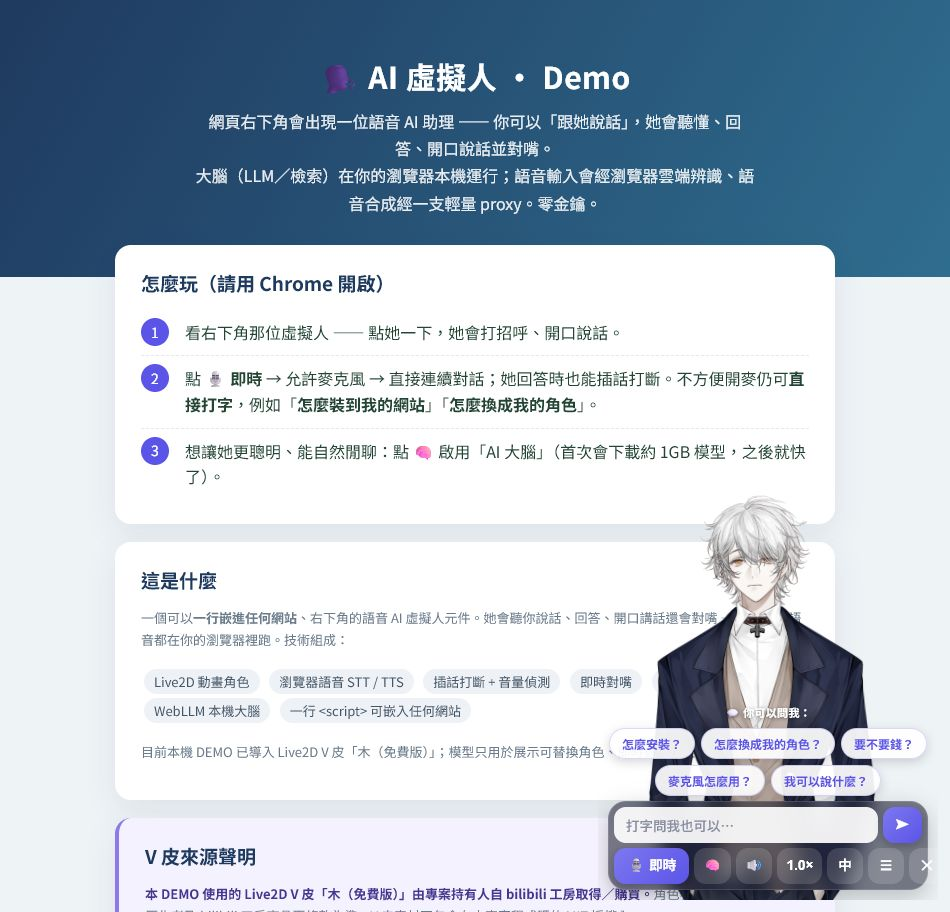
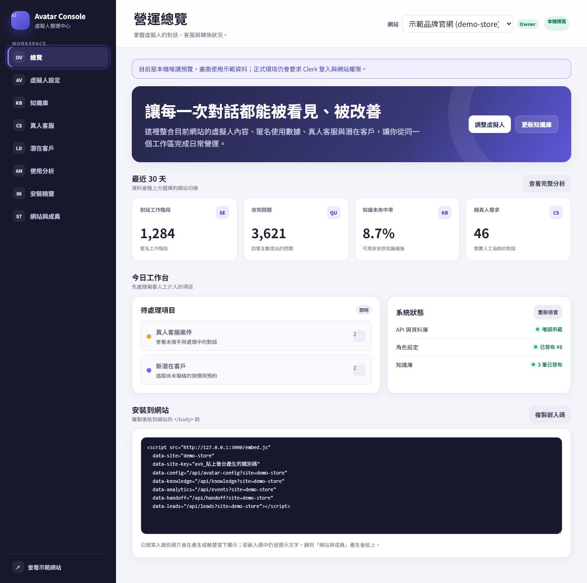

# AI 虛擬人 Widget（Live2D 語音助理）

**繁體中文** | [English](README.en.md)

[](https://ko-fi.com/yuricrystal)

> 一個「一行 `<script>` 嵌入任何網站」的右下角 Live2D 語音 AI 虛擬人元件。
> 你可以對虛擬人說話，角色會聽懂、回答、開口說話並即時對嘴。
>
> 設計成「**引擎（肉）＋ 可換的皮（角色模型）＋ 內容（知識庫）**」：核心通用，角色與內容用 `data-*` 自己換。
> **預設純前端、免後端、不依賴任何外部網域**（語音用瀏覽器內建；想要更自然的神經語音再選配一支 function）。

🔗 線上 Demo：<https://ai-avatar-bot-two.vercel.app>（請用 **Chrome 桌機**開啟）

## ☕ 支持開源與付費協助

核心程式會持續以開源方式分享。你可以單純贊助開發，也可以選擇需要實際投入時間的付費協助：

- [☕ 贊助開源開發](https://ko-fi.com/yuricrystal)
- [🧑‍💻 一對一 AI 虛擬人安裝教學 — US$59](https://ko-fi.com/c/6d12b36a8f)
- [🛠️ AI 虛擬人基礎代客安裝 — US$149](https://ko-fi.com/c/96de6a2cc1)

> 贊助用於支持主機、AI 服務、文件與後續實驗，不包含個別技術服務；教學與代客安裝的範圍、交付時間及買家須知請以 Ko-fi 服務頁為準。



> 線上／本機 DEMO 目前使用 Live2D V 皮「木（免費版）」，由專案持有人自 **bilibili 工房取得／購買**。模型由獨立的 Vercel 靜態資產站提供，沒有提交到此 GitHub repo，也不包含在本專案程式碼的 MIT 授權內。瀏覽器為了顯示角色仍需公開讀取資產網址；這不代表訪客取得修改、商用或再散布授權，實際權利依原作者及商品頁條款為準。

## 🧭 營運管理後台



同一個工作區可管理虛擬人設定、知識庫版本、匿名使用分析、真人客服案件、潛在客戶／預約、網站安裝碼與成員權限。本機可用 `admin.html?preview=1` 查看唯讀示範資料；正式環境會使用 Clerk 登入與 Neon Postgres 保存資料。

---

## ✨ 功能

- **Live2D 動畫角色**＋即時**對嘴**（依實際音量驅動嘴型）
- **逐句開講**：長回答切句、講第一句時預抓下一句；開了 🧠 大腦更是**邊生成邊講**，不用等整段
- **情緒表情（3D）**：依回答內容自動變臉（開心／驚訝／抱歉），講完慢慢回中性
- **兩種人格模式**：預設「導覽助理」；`data-mode="companion"` 變**陪伴模式**，多出本機記憶（記得名字與聊過的話；只存訪客瀏覽器、說「忘記我」即清除）
- **即時語音輸入（STT）**：一鍵持續輪流對話、即時顯示部分辨識字幕、安靜後自動送出，回答途中可直接插話打斷；也可**直接打字**（Enter／➤ 送出，IME 組字不誤送）
- **語音輸出（TTS）**：神經語音（可選男女聲），失敗自動退回同語系的瀏覽器內建語音
- **大腦**：知識庫檢索（即時、零金鑰）＋可選的瀏覽器內 LLM（WebLLM，零金鑰）
- **聊天紀錄**：本次開啟期間可回看問答、複製回答、重播語音或一鍵清除（不會自動上傳／永久保存）
- **懂目前頁面**：宿主可用 `setContext()` 傳入商品、方案或會員狀態，回答時會連同知識庫一起參考
- **智慧網站操作**：宿主可註冊 `registerTool()`；虛擬人會依關鍵字、範例語句、描述與優先權評分，抽取參數、處理衝突並在父頁驗證後執行
- **匿名事件介面**：用 `on()` 接收訊息、工具確認／結果等事件，方便串接自己的分析服務
- **多語音與表情 API**：可切換繁中／英文／日文／韓文的辨識與聲線，並由網站觸發角色情緒
- **一行嵌入**：`embed.js` 動態建立 iframe widget，不干擾宿主網站

## 🧱 架構

| 檔案 | 說明 |
|---|---|
| `index.html` | 示範 landing 頁（嵌入 widget） |
| `widget.html` | iframe 內的虛擬人本體（Live2D／STT／TTS／對嘴／LLM／檢索） |
| `embed.js` | 一行嵌入載入器（建 iframe ＋ `postMessage` 父子溝通 ＋ 對外 `window.AvatarWidget` API） |
| `tool-router.js` | 工具意圖評分、歧義判斷、參數抽取與輸入 Schema 驗證 |
| `knowledge.js` | 知識庫（FAQ 範例內容，可自行替換） |
| `demo-host.html` | 模擬「客戶網站」的示範頁 |
| `admin.html` | 登入式知識庫後台：文件匯入、編輯、驗證、草稿、發布與版本復原 |
| `admin.js` | Clerk 登入、PDF／文字／JSON 匯入、草稿／發布、版本復原與後台操作介面 |
| `api/admin/*` | 受 Clerk token 與管理者白名單保護的後台 API |
| `api/knowledge.js` | 提供目前發布版本給虛擬人讀取的公開端點 |
| `api/events.js` | 選用的匿名問題／回答來源分析事件端點 |
| `api/admin/analytics.js` | 受管理者登入保護的統計查詢端點 |
| `api/handoff.js` | 訪客建立客服案件、留言與讀取真人回覆的端點 |
| `api/admin/support.js` | 管理者接手、回覆、內部備註與結案端點 |
| `lib/knowledge-store.js` | Neon Postgres 永久資料與版本控制 |
| `lib/analytics-store.js` | 分析事件驗證、隱私遮蔽、保存期限與統計查詢 |
| `lib/support-store.js` | 客服案件、訊息、存取憑證與狀態管理 |
| `lib/safe-url.js` | HTTPS 網址匯入、重新導向與內網位址防護 |
| `knowledge-builder.js` | 文件清理、切段、問題與關鍵字建立、來源標記 |
| `api/tts.js` | Vercel serverless function：取得神經語音 MP3 |
| `m1-standalone.html` | 早期里程碑的單檔版（純參考，可刪） |

預設的展示 widget 仍可用**純前端（HTML/JS）**執行；登入式後台、版本保存與網址匯入才需要 Clerk、Neon 與 serverless functions。

## 📥 安裝（三種方式，由簡到進階）

### 方式 1 — 自帶安裝（推薦：純前端、免後端、不依賴任何外部網域）
把 `widget.html`、`embed.js`、`knowledge.js` 三個檔放進**你自己的網站**，貼一行：
```html
<script src="/path/embed.js"
        data-model="你的-live2d.model3.json"
        data-knowledge="你的-faq.json"></script>
```
全部在訪客瀏覽器裡跑，語音用瀏覽器內建（zh-TW）。**零後端、零金鑰、零雲端成本。**

### 方式 2 — 託管一行（最快試玩）
直接引用別人已部署好的 `embed.js`（⚠ 運算與流量算在那個部署擁有者頭上）：
```html
<script src="https://你的部署.vercel.app/embed.js"></script>
```

### 方式 3 — 完整版含「神經語音」（較自然的真人感嗓音）
神經語音需要 `api/tts.js`（serverless function）。把整包部署到 Vercel：
```bash
npm install
vercel --prod          # 本機開發：vercel dev
```
沒設 `data-api` 時 widget 會自動試同站的 `api/tts`，抓不到就退回瀏覽器語音。

## 🎭 換成你自己的 3D 角色（VRM）


這個元件**不夾帶任何 3D 角色**（避開授權與檔案大小問題）——3D 皮是「你自己的」。三種導入方式：

**① 拖放試玩（最快，零改 code）**
直接把你的 `.vrm` 檔**拖到角色身上**，立刻換成你的 3D 角色，還會自動長出 2D/3D 切換鈕。適合快速試。

**② 網址／embed 永久換**
- 嵌到你網站：`<script src="embed.js" data-vrm="你的.vrm"></script>`（再加 `data-model` 給 2D 就會有 2D/3D 切換鈕）
- 本機試：`widget.html?dev=1&engine=3d&vrm=你的.vrm`

**③ 哪裡拿 VRM？**
- **[VRoid Studio](https://vroid.com/studio)**（免費）→ 自己捏一個動漫角色、匯出 `.vrm`
- **[VRoid Hub](https://hub.vroid.com)** / **[Booth](https://booth.pm)** → 別人做好的模型
- **懶得捏？拿官方免費範例立刻試**（網址直接填給 `data-vrm`／`?vrm=`，皆已實測可跑）：
  - `Alicia`（ニコニ立体ちゃん，7.8MB，[使用條款](https://3d.nicovideo.jp/alicia/rule.html)）
    `https://cdn.jsdelivr.net/gh/vrm-c/UniVRM@master/Tests/Models/Alicia_vrm-0.51/AliciaSolid_vrm-0.51.vrm`
  - `Seed-san`（VirtualCast，[VRM Public License 1.0](https://vrm.dev/en/licenses/1.0/index)）
    `https://cdn.jsdelivr.net/gh/vrm-c/vrm-specification@master/samples/Seed-san/vrm/Seed-san.vrm`
  - `Sample`（pixiv three-vrm 官方範例）
    `https://cdn.jsdelivr.net/gh/pixiv/three-vrm@dev/packages/three-vrm/examples/models/VRM1_Constraint_Twist_Sample.vrm`

> ⚠ **授權**：每個 `.vrm` 內嵌作者設定的使用條款（可否商用／修改）——商用前務必確認；自己用 VRoid Studio 捏的最單純。
> 📦 **檔案大小**：VRM 通常 10–30MB，**別塞進 git**；放 CDN／GitHub Release／自己的網站，用 `data-vrm` 指過去。

<br clear="all">

## 🌐 瀏覽器需求

- **Chrome / Chromium 桌機**（語音辨識 `webkitSpeechRecognition` 僅 Chromium 支援）
- 想啟用 🧠 瀏覽器內 LLM：需 **WebGPU**（Chrome 113+）
- 麥克風（語音輸入用）；TTS 與 LLM 需要 **HTTPS**（或 localhost）

### 即時語音對話

點「🎙️ 即時」並允許麥克風後，元件會持續完成「聽你說話 → 安靜約一秒後送出 → 回答 → 自動再聽」的循環。控制列會顯示即時音量、辨識中的字幕與目前是聆聽／思考／回答狀態。虛擬人回答時可以直接插話；本機音量偵測確認有人聲後會停止朗讀與尚未完成的回答，再立刻重新聽取。

音量偵測使用瀏覽器 `getUserMedia`、回音消除、降噪與自動增益，只在當下頁面記憶體處理，不保存原始音訊。收起虛擬人、切到背景頁面、再次按下語音按鈕或連續三次沒有聲音時會自動關閉麥克風。實際文字辨識仍由 Chromium 的 Web Speech 服務處理，並非完全離線。

## ⚙️ 設定（`embed.js` 的 `data-*` 屬性）

| 屬性 | 作用 | 預設 |
|---|---|---|
| `data-config` | **集中角色設定**：公開設定端點，例如 `/api/avatar-config?site=default`；會載入後台已發布的角色、聲線、文案、品牌色與尺寸 | 關閉 |
| `data-site` | **租戶站點代號**：通常可由 `data-config`／`data-knowledge`／`data-analytics`／`data-handoff`／`data-leads` 的 `?site=` 自動推導，也可明確指定 | `default` |
| `data-site-key` | **多租戶公開寫入識別碼**：保護分析、客服與名單不會誤寫到其他網站；由網站 Owner 在後台產生 | 未啟用（設 `REQUIRE_SITE_KEY=true` 後為必填） |
| `data-model` | **皮（2D）**：Live2D `.model3.json` 網址 | 內建 Haru 範例 |
| `data-model-mobile` | **手機輕量皮（2D）**：窄螢幕或省流量模式時取代 `data-model` | 未設定 |
| `data-fallback-model` | **備援皮（2D）**：自訂模型載入失敗時自動切換 | Haru 公開範例 |
| `data-zoom` | **2D 半身取景縮放**：數值越大角色越近，安全範圍 `1`–`3` | `1.9` |
| `data-look` | **滑鼠視線跟隨（選用）**：`true` 開啟；不想讓角色跟著游標看時設為 `false` | `true` |
| `data-vrm` | **皮（3D）**：VRM `.vrm` 網址；設了就改走 3D（three-vrm）引擎，可拖放／換成自製 VRoid 角色 | 無（不設＝走 2D Live2D） |
| `data-engine` | 預設引擎 `2d`／`3d`；**同時給 `data-model` ＋ `data-vrm` 時，widget 會長出 2D/3D 即時切換鈕** | 有 2D 皮→`2d`，否則 `3d` |
| `data-mode` | **人格**：`assistant` 導覽助理／`companion` **陪伴模式**（兩者都有即時語音；陪伴模式另有本機記憶） | `assistant` |
| `data-lang` | 對話語言 `zh-TW`／`en-US`／`ja-JP`／`ko-KR`（也可在元件內切換） | `zh-TW` |
| `data-knowledge` | **內容**：知識庫 JSON 網址（陣列 `[{q,kw,a}]`） | 內建 `knowledge.js` |
| `data-analytics` | **匿名分析（選用）**：同網域事件端點，例如 `/api/events?site=default`；未設定就完全不記錄 | 關閉 |
| `data-handoff` | **站內真人客服（選用）**：同網域客服端點，例如 `/api/handoff?site=default` | 關閉 |
| `data-leads` | **詢價／預約收集（選用）**：宿主網站同來源端點，例如 `/api/leads?site=default` | 關閉 |
| `data-api` | **肉**：神經語音後端端點；不設＝純瀏覽器語音 | 試同站 `api/tts` |
| `data-voice` | 神經語音聲線（需後端支援） | `zh-TW-HsiaoChenNeural` |
| `data-widget` | `widget.html` 的網址 | 跟 `embed.js` 同目錄 |
| `data-open` | 是否一進站就展開（`false`＝先收成泡泡） | 桌機展開、手機收合 |
| `data-width`／`data-height` | 單頁覆寫視窗尺寸；寬 280–480、高 380–720 | 後台發布值或 340×480 |

`data-config` 載入的是全站發布設定；同一個 `<script>` 上明確設定的 `data-model`、`data-model-mobile`、`data-fallback-model`、`data-vrm`、`data-engine`、`data-voice`、`data-lang`、`data-mode`、`data-fit`、`data-width` 或 `data-height` 會優先，方便特定頁面局部覆寫。

滑鼠視線跟隨預設保留給開源使用者；不需要時，在嵌入碼加入 `data-look="false"` 即可關閉。此本機 DEMO 已採用關閉設定。

對外 JS API：`window.AvatarWidget.open() / close() / say(text) / ask(text) / setContext(context) / setLocale(locale) / setExpression(name) / registerTool(definition) / unregisterTool(name) / setHandoff(options) / on(name, handler) / off(name, handler)`。
（`say`＝直接唸出這段字；`ask`＝幫使用者問一個問題、會跑檢索／大腦回答，例如 landing 頁點卡片就讓虛擬人開口回答。）

頁面情境與網站工具範例：

```html
<script>
  AvatarWidget.setContext({
    title: document.title,
    product: '專業方案',
    price: 'NT$990／月',
    signedIn: true
  });

  AvatarWidget.registerTool({
    name: 'open_checkout',
    label: '前往結帳',
    description: '開啟目前商品的結帳頁',
    keywords: ['結帳', '購買', '我要買'],
    examples: ['我要買兩個', '幫我前往結帳'],
    excludeKeywords: ['查看購買紀錄'],
    priority: 2,
    requiresConfirmation: true,
    timeoutMs: 12000,
    inputSchema: {
      type: 'object',
      properties: {
        quantity: { type: 'integer', title: '數量', minimum: 1, maximum: 99, prefixes: ['數量', '買'] },
        productId: { type: 'string', title: '商品', contextKey: 'productId' }
      },
      required: ['quantity', 'productId']
    },
    execute: function (input) {
      // input.args 已依 schema 重新驗證；input.signal 可用來取消逾時中的 fetch
      location.href = '/checkout?product=' + encodeURIComponent(input.args.productId) + '&quantity=' + input.args.quantity;
      return '已準備 ' + input.args.quantity + ' 件商品的結帳頁。';
    }
  });

  AvatarWidget.on('tool_result', function (event) {
    // 在這裡串接你自己的匿名分析服務
    console.log(event);
  });

  AvatarWidget.setHandoff({
    label: '轉接 LINE 客服',
    url: 'https://line.me/R/ti/p/@YOUR_ACCOUNT'
  });
</script>
```

`setContext()` 只接受簡單字串／數字／布林／字串陣列，並限制欄位數與長度；請勿放密碼、權杖、完整信用卡或其他敏感資料。網站工具的 `execute` 函式只留在父頁，不會傳進 iframe。

工具路由會綜合 `keywords`、`examples`、`label`、`description`、`priority` 與 `routeThreshold` 計算信心。兩個結果太接近時會要求使用者選擇；`inputSchema.required` 缺值時會逐項追問，支援 `string`、`number`、`integer`、`boolean`、`enum`、`email`、`url`、`phone`、`contact`（電子郵件或電話）、`contextKey` 與 `prefixes`。父頁執行前會再次驗證參數、阻止同工具重複執行，並在 `timeoutMs` 到期時中止 `input.signal`。

只有確定為唯讀、可安全重複的操作才應設定 `requiresConfirmation:false`；購買、送出資料、刪除、導頁或其他有外部影響的操作應保留確認。`tool_offer`、`tool_input_required`、`tool_ambiguous`、`tool_execute`、`tool_result` 事件可供宿主記錄路由信心、執行結果與耗時。

管理後台在 `admin.html`，採用獨立總覽、左側功能導覽與響應式工作區，支援 Clerk 登入、管理者白名單、知識庫與角色設定的永久儲存、草稿、發布與版本復原。總覽會整合匿名對話指標、待處理客服、新潛在客戶、發布狀態、健康檢查與可複製的網站嵌入碼。公開 widget 可把 `data-knowledge` 指向 `/api/knowledge?site=default`，並用 `data-config="/api/avatar-config?site=default"` 載入角色設定；兩者都只會讀到目前發布版本。

「安裝精靈」可選擇知識庫、匿名分析、真人客服與詢價／預約功能，自動產生對應嵌入碼，並檢查主要網域、公開寫入識別碼、載入器、角色設定、知識庫與健康端點。若使用跨網域載入器，`data-leads` 仍需指向宿主網站同來源端點或代理。

### 角色設定中心

管理者可以不改程式就設定角色名稱、助理／陪伴模式、語言、Live2D／VRM 模型、預設引擎、取景、TTS 聲線、歡迎詞、點擊問候、未命中回覆、提示問題、品牌色與視窗尺寸。按「驗證並預覽」只會更新後台預覽；「儲存設定草稿」保留版本但不影響網站；「發布角色設定」才會更新公開端點。模型網址只接受 HTTPS 或站內相對路徑。

### 匿名使用分析

在嵌入標籤加入 `data-analytics="/api/events?site=default"` 後，管理後台會顯示最近 7／30／90 天的工作階段、問題數、未命中率、轉人工需求、熱門問題與待補知識。

分析功能採明確開啟：沒有 `data-analytics` 就不送任何事件；瀏覽器開啟 Do Not Track 或使用陪伴模式時也會停用。只保存隨機工作階段 ID、問題文字、回答類型與命中的知識題目，不保存帳號、姓名、IP 或完整回答。常見電子郵件與長數字會先遮蔽，資料預設保留 180 天，可用 `ANALYTICS_RETENTION_DAYS` 設為 7～730 天。正式使用時仍應在隱私權政策告知訪客，並避免收集不必要的敏感資訊。

### 站內真人客服

在嵌入標籤加入 `data-handoff="/api/handoff?site=default"` 後，訪客說「真人客服」「轉真人」等關鍵字並確認，就會建立站內客服案件。最近 12 則對話會一併交給管理者；訪客可繼續在原聊天框留言，工作台的客服回覆會每 5 秒同步回虛擬人。管理者可接手、回覆、加上訪客看不到的內部備註、結案與重新開啟。

訪客的案件憑證只存在該分頁的 `sessionStorage`，資料庫只保存雜湊值；API 不接受跨網站請求並設有基本限流。已結案案件預設保留 365 天，可用 `SUPPORT_RETENTION_DAYS` 設為 30～1825 天。由於客服內容可能包含個人資料，正式上線前必須在隱私權政策說明用途、保存期限與刪除方式。

### 潛在客戶與預約收集

加入 `data-leads="/api/leads?site=default"` 後，訪客說「詢價、預約、請業務聯絡」等需求時，虛擬人會依序詢問姓名、電子郵件或電話、需求內容及選填的公司名稱。最後必須明確同意依隱私權政策使用資料，並再次確認後才會送出；若回答「不同意」就立即取消，不保存資料。

管理後台可搜尋與篩選新名單、已聯絡、有效機會及已結束，查看來源頁面、同意時間、負責人與內部備註，也能永久刪除資料或匯出目前篩選結果為防試算表公式注入的 CSV。API 只接受宿主網站同來源請求並有基本限流，不把 IP 寫入資料庫。資料預設保存 365 天，可用 `LEADS_RETENTION_DAYS` 設為 30～1825 天；正式使用前必須提供可讀的隱私權政策與刪除／撤回管道。

### 多網站與成員權限

後台可建立多個網站並用頂端選單切換；每個網站的知識庫、角色設定、分析、潛在客戶及客服資料都以 `siteId` 隔離。`ADMIN_USER_IDS` 是可建立網站並存取全部租戶的全域管理者；各網站 Owner 可用 Clerk User ID 新增成員：

- **Viewer**：只能查看內容與資料。
- **Editor**：可以發布角色／知識、處理名單與客服，但不能管理成員。
- **Owner**：擁有 Editor 權限，另可修改網站資料與成員角色。

權限不是只靠前端隱藏按鈕；每一個管理 API 都會驗證 Clerk token、嚴格檢查網站代號，再確認該使用者在該網站的角色。無效網站代號不會退回 `default`，網站也至少必須保留一位 Owner。

每個新網站會產生一組 `avk_…` 公開寫入識別碼，加入嵌入碼：

```html
<script src="https://你的網域/embed.js"
        data-site-key="avk_替換成後台產生的值"
        data-analytics="/api/events?site=brand-tw"
        data-handoff="/api/handoff?site=brand-tw"
        data-leads="/api/leads?site=brand-tw"></script>
```

它會出現在公開頁面，因此不是密碼；用途是避免猜測 `siteId` 或設定錯誤造成跨租戶寫入。Owner 輪替後舊值立即失效，必須同步更新所有嵌入頁面。即使啟用識別碼，正式站仍應保留 Firewall 限流。

正式環境請設定 `REQUIRE_SITE_KEY=true`。此時只要有啟用中的網站尚未產生公開寫入識別碼，健康檢查會回報 degraded，公開分析、客服與名單寫入也會暫停；請先在後台產生識別碼並更新所有 `data-site-key`。

### 管理操作稽核與健康檢查

網站 Owner 可在成員管理區查看最近的發布、還原、名單、客服、成員與公開識別碼操作。紀錄只包含 Clerk User ID、動作、目標類型／編號與時間，不保存知識內容、客服對話、聯絡方式、需求、內部備註、token 或公開識別碼；預設保存 365 天，可用 `AUDIT_RETENTION_DAYS` 設為 30～2555 天。

`GET /api/health` 只回傳 `ok` 或 `degraded`，可供 Vercel／外部監控檢查服務與資料庫是否可用，不會公開環境變數、資料量或錯誤細節。

### 文件自動建立知識庫

- 可匯入 PDF、純文字、Markdown、既有 JSON，或貼上一段內容；PDF 會在管理者的瀏覽器本機抽取文字，不會把原始檔上傳到伺服器。
- 可輸入公開 HTTPS 網址，由受登入保護的後端抓取可讀文字；會拒絕內網／保留位址、非標準連接埠、過多重新導向與過大內容。
- 內容會自動清理、切段、產生問題與關鍵字，並保留來源名稱／網址。匯入後只進入編輯預覽，必須由管理者檢查後再存草稿或發布。
- PDF 上限 30MB／300 頁／50 萬字；網址來源上限 2MB。掃描圖片型 PDF 沒有文字層，需先做 OCR。
- 只匯入你擁有、已獲授權或依法可使用的內容；網站可公開瀏覽不代表可重製或作為知識庫使用。

### 正式後台設定

> 公開線上 Demo 使用 Vercel Hobby 方案，因此 repo 內的 `.vercelignore` 會在 Demo 部署時排除完整後台 API，只保留 TTS；`admin.html?preview=1` 仍可查看唯讀示範。若要部署完整後台，請移除其中的 `api/admin/` 與各公開 API 排除規則，並使用可容納目前函式數量的方案／平台，或先把 API 合併成較少的函式。

1. 從 Vercel Marketplace 安裝 Clerk 與 Neon，讓 Vercel 自動注入登入和 `DATABASE_URL`。
2. 依 `.env.example` 補上全域管理者 `ADMIN_USER_IDS` 與 `ADMIN_ALLOWED_ORIGINS`；User ID 可在 Clerk Dashboard 的 Users 頁面取得。其他網站成員登入後由 Owner 在後台加入。
3. 本機用 `vercel env pull .env.local --yes` 同步環境變數，再執行 `vercel dev`。
4. 第一次使用時後端會自動建立網站租戶／成員、知識庫、角色設定、分析、客服與潛在客戶資料表；正式維運也可先在 Neon SQL Editor 依序執行 `db/migrations/` 內的 migration。

後台 API 會驗證 Clerk token 的簽章、來源與管理者 User ID。`CLERK_SECRET_KEY`、`CLERK_JWT_KEY`、`DATABASE_URL` 絕對不能放進前端或提交到 Git；`CLERK_PUBLISHABLE_KEY` 才是可公開值。

**內容白標（`window.KB_META`）**：在你的 `knowledge.js` 裡設 `window.KB_META = { name, welcome, greeting, sgLabel, suggestions:[…], fallback }`，就能讓「開場白／打招呼／提示鈕／答不出來的兜底」全跟著你的領域走——同一顆引擎可當客服／居家修繕／導覽…（不設＝用預設）。

> 神經語音後端 `api/tts.js` 預設只接受「同網域來源」呼叫（防被當免費 TTS proxy）；可用環境變數 `TTS_ALLOWED_HOSTS`（逗號分隔）加白名單。**公開部署務必在 Vercel 開用量上限。**

---

## 📦 第三方資產與授權（**請務必先讀**）

本專案自己的程式碼採 **MIT**（見 `LICENSE`）。但它**相依**以下第三方，各有各的授權，**不在 MIT 範圍內**：

| 來源 | 授權 / 注意 |
|---|---|
| **Live2D Cubism Core**（CDN `cubism.live2d.com`） | **專有授權**（Live2D Proprietary Software License）。非開源，商用/再散佈須自行確認 Live2D 條款。 |
| **Haru 範例模型**（CDN，pixi-live2d-display 測試資產） | Live2D **Free Material License**，**僅供範例**。正式上線請換成你自有合法授權的模型。本 repo 不夾帶模型檔，採 CDN 引用。 |
| **「木（免費版）」Live2D V 皮**（線上／本機 DEMO） | 由專案持有人自 **bilibili 工房取得／購買**；不屬於本專案 MIT 授權。模型由獨立靜態資產站載入，本 repo 的 `models/` 仍被 Git 忽略。瀏覽器可讀取不等於獲得修改、商用或再散布權，實際限制以原作者及商品頁條款為準。 |
| **pixi.js / pixi-live2d-display** | MIT |
| **three.js / @pixiv/three-vrm** | MIT |
| **@mlc-ai/web-llm**（WebLLM） | Apache-2.0；下載的模型權重各有授權（Qwen2.5 為其自身條款） |
| **PDF.js / pdfjs-dist**（後台 PDF 文字抽取） | Apache-2.0；由 jsDelivr CDN 載入固定版本 |
| **Cheerio**（後端網頁文字清理） | MIT |
| **Clerk SDK / Neon serverless driver** | SDK 為 MIT；Clerk／Neon 託管服務另受各自服務條款與方案限制 |
| **msedge-tts**（`api/tts.js` 用） | 套件本身開源，但它連線的是**微軟 Edge 朗讀的「非官方」語音端點**（見下方風險） |

## ⚠️ 風險與限制揭露

- **TTS 走非官方端點**：`/api/tts` 透過 `msedge-tts` 連到微軟 Edge 朗讀的**非官方**語音服務（免帳號免金鑰）。**這不是官方支援、可能違反微軟服務條款、隨時可能失效或被封鎖。** 正式環境建議改接官方 **Azure Speech** 或其他有授權的 TTS。失效時 widget 會自動退回瀏覽器內建語音。
- **`/api/tts` 是公開端點**：預設只做「同網域來源檢查」＋輸入長度上限，**沒有完整限流**。自架者請務必在 **Vercel 專案層開啟用量上限（Spend Management）/ Firewall 限流**，避免被當免費 TTS proxy 灌爆帳單。
- **`/api/events` 是公開寫入端點**：程式內有同網域檢查、工作階段與來源位址的基本限流，但公開網站仍可能被自動化流量污染。正式部署建議再用 Vercel Firewall 設定每來源速率限制。
- **`/api/handoff` 是公開案件端點**：存取權靠每案件的隨機憑證，並有來源位址／工作階段限流；正式部署仍建議搭配 Vercel Firewall，管理者也應避免在內部備註貼入密碼或付款資料。
- **`/api/leads` 是公開提交端點**：程式要求同來源、明確同意、有效聯絡方式並做基本限流，但仍應搭配 Vercel Firewall、隱私權政策與最小權限管理，避免垃圾資料及個資濫用。
- **公開寫入識別碼不是秘密**：`data-site-key` 能防止猜測站點代號與意外跨租戶寫入，但訪客仍可從頁面看到；它不能取代 WAF、限流、CAPTCHA 或異常監控。
- **語音辨識會送到雲端**：本機音量／插話偵測不保存音訊，但 `webkitSpeechRecognition` 在 Chrome 下仍會把**麥克風音訊上傳到瀏覽器廠商（Google）**處理，**並非本機辨識**。請告知你的使用者。
- **LLM 在本機**：WebLLM 模型下載後在使用者瀏覽器內運行，問答內容不外傳；首次需下載約 1GB 模型。

## 🔐 隱私（資料流向）

| 功能 | 資料去哪 |
|---|---|
| 語音輸入（STT） | 麥克風音訊 → 瀏覽器廠商雲端（Chrome 為 Google） |
| 語音輸出（TTS） | 要朗讀的文字 → 你的 `/api/tts` → 微軟非官方 TTS 端點 |
| 大腦（LLM／檢索） | **本機**，不外傳 |
| 記憶（陪伴模式） | **本機且依 siteId 隔離**：訪客瀏覽器 localStorage，不上傳；說「忘記我」即清除 |
| 管理後台匯入 | PDF／文字檔在管理者瀏覽器處理；網址由你的後端讀取；草稿與發布內容存入 Neon |
| 匿名使用分析（選用） | 隨機工作階段、問題文字與回答來源 → 你的 `/api/events` → Neon；陪伴模式與 Do Not Track 不收集 |
| 站內真人客服（選用） | 訪客確認後，最近 12 則對話與後續客服訊息 → 你的 `/api/handoff` → Neon；內部備註不回傳訪客 |
| 詢價／預約收集（選用） | 訪客明確同意後，姓名、聯絡方式、公司（選填）、需求及來源頁面 → 你的 `/api/leads` → Neon；不保存 IP |

未啟用分析、客服或詢價／預約端點時，專案不會保存相應資料；啟用後會依上表寫入你自己的 Neon。部署平台（如 Vercel）仍可能依其設定保留 function 請求日誌。

## 📝 內容說明

`knowledge.js` 內建的是「**這個元件本身的使用教學**」當示範內容（demo 讓虛擬人自己當說明書）。換成你自己的領域只要改 `knowledge.js`，或用 `data-knowledge` 指向你的 JSON。若你要拿來做特定領域（醫療、法律、金融等）的問答，請自行加上該領域必要的免責聲明。

## 🤝 貢獻

歡迎開 issue / PR。（若日後考慮商業授權，接受外部 PR 前可先設置 CLA。）

## 📄 授權

MIT — 見 [`LICENSE`](./LICENSE)。第三方資產不在此授權範圍，見上方表格。
